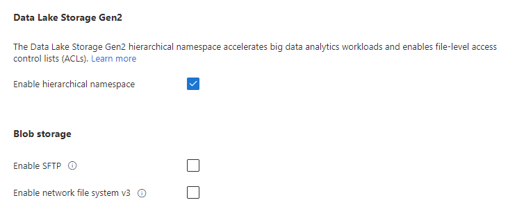

# Problem statement

Recently Azure GA-ed their popular SFTP endpoint for Blob Storage, this meant that the service comes at a cost of 30 cents per hour for an approximately monthly cost of over 200 USD.

That being said the SFTP endpoint can be enabled and disabled with a single az-cli command.

```bash
az storage account update \
    --name mysftpblobstorage \
    --resource-group mysftp-rg \
    --enable-sftp false
```

Or by simply navigating thru the Portal and just un-checking the "Enable SFTP" under Blob Storage.

Once that is done the customer would only pay the amount consumed up to that point.
The service itself is great, it offers no management overhead for SFTP, while supporting both User/Password or Key based authentication methods with secure encryption algorithms, so if you are enterprise I would say ~200 USD well spent.

What if you would like to run the ~~same~~ similar type of service on your own, and thats going to be the article below.
I will try to describe one of the cheapest setups that would ~~almost~~ mostly offer the same service.
_TLDR_ A single VM will not provide the same SLA or throughput but if you are interested I have suggestions for that too. I'm also going to assume that the Storage account is already created.

First step is to create a VM, that will run the SFTP daemon and mount our Blob storage container. The VM SKU is important as long as it has enough CPU/Memory and Network bandwidth to be able to cope with incoming SFTP transfers and writing files to the blob-fuse mount point.

Before we start we are going to pre-create some resources like VNets, Subnets, NSGs and rules and PublicIP, this is an assumption that we want to have the VM separated from our other workloads, with a Public IP as Ingress and somewhat open access for SFTP.

```bash
#
# variable declaration
#
RG='rg-linux-to-blob'
LOCATION='eastus'
VM_NAME='linux001'
VM_USERNAME='azureadmin'
VM_SIZE='Standard_B1ls'
VM_IMAGE='Canonical:0001-com-ubuntu-minimal-jammy:minimal-22_04-lts-gen2:22.04.202305150'
VM_STORAGE_SKU='Standard_LRS'
VM_NIC_NAME='nic001-linux001'
VM_NIC_IPCONFIG1='10.250.0.4'
VM_NIC_IPCONFIG2='10.250.0.5'
VM_CUSTOM_SFTP_PORT='50439'

VNET_NAME='vnet001'
VNET_PREFIX='10.250.0.0/28'
SN_NAME='sn001'
SN_PREFIX='10.250.0.0/28'

NSG_NAME='protect-vms'
NSG_SSH_RULE='Allow-SSH-From-MY-HOME-IP'
NSG_SFTP_RULE='Allow-SFTP-From-ANY'
NSG_DENY_ALL='Deny-ANY-ANY'

PIP_NAME='pip-linux001'
PIP_SKU='Basic'
PIP_DNS='linux-to-blob'
PIP_METHOD='Dynamic'
PIP_VERSION='IPv4'
PIP_FQDN="${PIP_DNS}.${LOCATION}.cloudapp.azure.com"

MY_HOME_IP="$(curl https://ifconfig.me)"

TAGS='Workload=Linux-to-Blob'

#
# end of variable declaration
#
```

```bash
az group create \
    --name $RG \
    --location $LOCATION \
    --tags $TAGS
```

```bash
az network vnet create \
    --name $VNET_NAME \
    --resource-group $RG \
    --location $LOCATION \
    --address-prefix $VNET_PREFIX \
    --subnet-name $SN_NAME \
    --subnet-prefixes $SN_PREFIX \
    --tags $TAGS
```

```bash
az network public-ip create \
    --name $PIP_NAME \
    --location $LOCATION \
    --resource-group $RG \
    --dns-name $PIP_DNS \
    --sku $PIP_SKU \
    --allocation-method $PIP_METHOD \
    --version $PIP_VERSION \
    --tags $TAGS
```

```bash
az network nsg create \
    --name $NSG_NAME \
    --resource-group $RG \
    --location $LOCATION \
    --tags $TAGS
```

```bash
az network nsg rule create \
    --resource-group $RG \
    --nsg-name $NSG_NAME \
    --name $NSG_SSH_RULE \
    --access Allow \
    --protocol Tcp \
    --direction Inbound \
    --priority 100 \
    --source-address-prefix "${MY_HOME_IP}/32" \
    --source-port-range '*' \
    --destination-address-prefix $VM_NIC_IPCONFIG1 \
    --destination-port-range 22
```

```bash
az network nsg rule create \
    --resource-group $RG \
    --nsg-name $NSG_NAME \
    --name $NSG_SFTP_RULE \
    --access Allow \
    --protocol Tcp \
    --direction Inbound \
    --priority 200 \
    --source-address-prefix Internet \
    --source-port-range '*' \
    --destination-address-prefix $VM_NIC_IPCONFIG2 \
    --destination-port-range $VM_CUSTOM_SFTP_PORT
```

```bash
az network nsg rule create \
    --resource-group $RG \
    --nsg-name $NSG_NAME \
    --name $NSG_DENY_ALL \
    --access Deny \
    --protocol '*' \
    --direction Inbound \
    --priority 4096 \
    --source-address-prefix '*' \
    --source-port-range '*' \
    --destination-address-prefix '*' \
    --destination-port-range '*'
```

```bash
az network nic create \
    --resource-group $RG \
    --name $VM_NIC_NAME \
    --location $LOCATION \
    --ip-forwarding false \
    --subnet $SN_NAME \
    --vnet-name $VNET_NAME \
    --network-security-group $NSG_NAME \
    --tags $TAGS
```

```bash
az network nic ip-config create \
    --resource-group $RG \
    --nic-name $VM_NIC_NAME \
    --name ipconfig1 \
    --private-ip-address $VM_NIC_IPCONFIG1 \
    --private-ip-address-version IPv4 \
    --subnet $SN_NAME \
    --vnet-name $VNET_NAME \
    --make-primary true \
    --public-ip-address $PIP_NAME
```

```bash
az network nic ip-config create \
    --resource-group $RG \
    --nic-name $VM_NIC_NAME \
    --name ipconfig2 \
    --private-ip-address $VM_NIC_IPCONFIG2 \
    --private-ip-address-version IPv4 \
    --subnet $SN_NAME \
    --vnet-name $VNET_NAME \
    --make-primary false
```

To get the latest Ubuntu image you can just run:

```bash
az vm image list -o json \
    --all --publisher Canonical | \
    jq '[.[] | select(.sku=="22_04-lts")] | max_by(.version)'
```

In this case cheapest would be **Standard_B1ls** with 1 CPU, 0.5 GB RAM, so it's _single az vm create_ time:

```bash
az vm create \
    --name $VM_NAME \
    --resource-group $RG \
    --admin-username $VM_USERNAME \
    --authentication-type ssh \
    --image $VM_IMAGE \
    --location $LOCATION \
    --nic-delete-option Delete \
    --os-disk-caching ReadOnly \
    --os-disk-delete-option Delete \
    --os-disk-size-gb 30 \
    --size $VM_SIZE \
    --ssh-key-values '~/.ssh/id_rsa.pub' \
    --storage-sku $VM_STORAGE_SKU \
    --nics $VM_NIC_NAME \
    --tags $TAGS
```

A bit of explanations regarding the above choices/options:

1. --authentication-type ssh - we want to allow just SSH key based access to the VM
1. --image $IMAGE - Latest Ubuntu should be fine otherwise something with SELinux
1. --location $LOCATION - I will assume that it's the same as the Storage Account
1. --nic-delete-option Delete - Delete the interface if the VM is deleted
1. --nsg $NSG_NAME - Previously created NSG
1. --os-disk-caching ReadOnly - What caching we enable for the OS disk
1. --os-disk-delete-option Delete - Delete the disk if the VM is deleted
1. --os-disk-size-gb - Adequate disk size for a Linux VM
1. --size - Cheapest VM size that I have access
1. --ssh-key-values - Path to your Public SSH key used for login and management
1. --storage-sku - Cheapest Disk, as we will not write to this
1. --zone - was not used because there's no support when using Basic PIP

There are a few alternatives and enhancements that could be done if we don't really want the cheapest solution:

1. Changing the VM and Disk SKU to something more performant
1. Use Spot Instances
1. Enabling Host Based Encryption with or without Customer Managed Keys
1. Enabling monitoring and logging
1. Using AADSSH for login or even JustInTime access
1. Adding Auto Shutdown for the VM

If HA is and SLA are legitimate concerns then setting up a Linux Extension Script addon that will automate the next steps and running the above VM in a VMSS configuration would be the best option. At that point the NSG should be moved to the Subnet.

Once the VM is installed we need to do a couple of things:

## Clean and harden the OS

### Disable Motd in Ubuntu

```bash
apt remove --purge motd-news-config -y
```

```bash
chmod -x /etc/update-motd.d/*
```

```bash
for i in update-notifier-download.timer motd-news.timer update-notifier-motd.timer ; do\
    systemctl mask --now $i;
done
```

I usually clean pam.d of motd too:

```bash
#
# modify in-place with backup commenting out the lines that contain pam_motd.so for file /etc/pam.d/login
#
sed -i.bak '/pam_motd.so/ s/./#&/' /etc/pam.d/login
```

```bash
#
# the same as above for /etc/pam.d/sshd
#
sed -i.bak '/pam_motd.so/ s/./#&/' /etc/pam.d/sshd
```

Remove snap as we are not going to use and it saves a bit of resources.

```bash
apt remove --purge snap* -y
```

### Configure multipe IPs on eth0

We will use one IP to listen specifically for SFTP and one we will use for SSH and management, this is important as the NSGs will allow only a list of Source IPs for port 22 whereas for SFTP port 50439 or $VM_CUSTOM_SFTP_PORT we will open it to the entire world.

```bash
cat <<EOF > /etc/cloud/cloud.cfg.d/99-disable-network-config.cfg
network:
config: disabled
EOF
```

```bash
HWETHER="$(cat /sys/class/net/eth0/address)"

VM_NIC_IPCONFIG1='10.250.0.4'
VM_NIC_IPCONFIG2='10.250.0.5'

VM_NIC_DEFAULT_ROUTE='10.250.0.1'

cat <<EOF > /etc/netplan/50-cloud-init.yaml
network:
  renderer: networkd
  ethernets:
    eth0:
      dhcp4: no
      dhcp6: no
      match:
        driver: hv_netvsc
        #
        # Ineterface eth0 MAC addresss
        #
        macaddress: ${HWETHER}
      #
      # Interface eth0 IP addresses as configure in Azure ipconfig1 and ipconfig2
      #
      addresses:
        - ${VM_NIC_IPCONFIG1}/28
        - ${VM_NIC_IPCONFIG2}/28
      nameservers:
        addresses:
          - 168.63.129.16
          - 1.1.1.1
          - 1.0.0.1
        search:
          - reddog.microsoft.com
          - internal.cloudapp.net
      routes:
        - to: default
          via: ${VM_NIC_DEFAULT_ROUTE}
  version: 2
EOF
```

### Update and setup automatic unattended updates

Enable ubuntu unattended updates:

```bash
cat <<EOF > /etc/apt/apt.conf.d/50unattended-upgrades
Unattended-Upgrade::Allowed-Origins {
        "${distro_id}:${distro_codename}";
        "${distro_id}:${distro_codename}-security";
        "${distro_id}ESMApps:${distro_codename}-apps-security";
        "${distro_id}ESM:${distro_codename}-infra-security";
        "${distro_id}:${distro_codename}-updates";
};
Unattended-Upgrade::Package-Blacklist {
};
Unattended-Upgrade::DevRelease "false";
Unattended-Upgrade::AutoFixInterruptedDpkg "true";
Unattended-Upgrade::MinimalSteps "true";
Unattended-Upgrade::Remove-Unused-Kernel-Packages "true";
Unattended-Upgrade::Automatic-Reboot "false";
Unattended-Upgrade::Automatic-Reboot-WithUsers "false";
Unattended-Upgrade::Automatic-Reboot-Time "02:00";
Unattended-Upgrade::Mail "some-email@example.com";
Unattended-Upgrade::MailReport "always";
Unattended-Upgrade::Remove-New-Unused-Dependencies "true";
Unattended-Upgrade::Remove-Unused-Dependencies "true";
EOF
```

```bash
cat <<EOF > /etc/apt/apt.conf.d/20auto-upgrades
APT::Periodic::Update-Package-Lists "1";
APT::Periodic::Unattended-Upgrade "1";
APT::Periodic::Download-Upgradeable-Packages "1";
APT::Periodic::AutocleanInterval "3";
EOF
```

```bash
systemctl restart unattended-upgrades.service
```

### Make sure we have entropy

Install entropy daemon.

```bash
apt update
apt install haveged -y
```

```bash
echo 'DAEMON_ARGS="-w 2048" > /etc/default/haveged'
```

```bash
systemctl enable --now haveged.service
systemctl enable --now pollinate
```

Check current available entropy.

```bash
cat /proc/sys/kernel/random/entropy_avail
```

### Setup proper NTP

Chrony should only listen on localhost.

```bash
echo bindaddress 127.0.0.1 >> /etc/chrony/chrony.conf
echo bindaddress ::1 >> /etc/chrony/chrony.conf
```

```bash
systemctl restart chrony
```

Check the new settings.

```bash
ss -ntulp | grep 323
```

### Add a VM firewall

```bash
apt update
apt install ufw -y
```

```bash
VM_CUSTOM_SFTP_PORT='50439'

ufw limit in 22/tcp
#
# port to be used only for SFTP
#
ufw limit in ${VM_CUSTOM_SFTP_PORT}/tcp comment 'port to be used only for SFTP'
ufw allow out 53/udp
ufw allow out 80/tcp
ufw allow out 443/tcp
```

If you are using Azure agents then allow that network traffic.

```bash
ufw allow out to 168.63.129.16/32 comment 'Used for Azure Agents'
```

```bash
ufw default deny outgoing
```

```bash
ufw enable
```

```bash
ufw status numbered
```

### Mount via PE the storage account

### Install blobfuse

Install blobfuse2 binaries for Ubuntu (22.04)

```bash
wget https://packages.microsoft.com/config/ubuntu/$(lsb_release -s -r)/packages-microsoft-prod.deb \
    -O /tmp/packages-microsoft-prod.deb 
```

```bash
apt-get update
apt-get install /tmp/packages-microsoft-prod.deb libfuse3-dev fuse3 blobfuse2 -y
```

### Create users and groups

Create specific users and groups for rights separation:

```bash
groupadd -g 1001 deny-ssh
```

```bash
groupadd -g 1002 sftpgroup
```

```bash
useradd sftpuser -g 1002 -G sftpgroup,deny-ssh -m -d /home/sftptoblob -s /bin/bash
```

### Cache ram disk for performance

The following example creates a RAM disk of 128 MB and a directory for BlobFuse2. Choose a size that meets your requirements. BlobFuse2 uses the RAM disk to open files that are up to 128 MB in size.

```bash
mkdir -p /srv/ramdisk/blobfuse2tmp
```

```bash
mount -t tmpfs -o size=128m tmpfs /srv/ramdisk/blobfuse2tmp
```

```bash
chown sftpuser:sftpgroup /srv/ramdisk/blobfuse2tmp
```

Make the mount point available after reboot.

```bash
echo 'tmpfs    /srv/ramdisk/blobfuse2tmp    tmpfs    defaults,noatime,nosuid,nodev,noexec,mode=0755,size=128M    0    2' \
    >> /etc/fstab
```

### Mount & fstab for blob storage

Create the blobfuse config file. At this point you can setup the Private Endpoint from your SA to the VNet where the VM was created, this is out of scope of this article.

```bash
SA_KEY="XXXXXXXXXXXXXXXXXXXXXXXXXXXXX"
SA_ACCOUNT_NAME="TO REPLACE WITH NAME OF THE STORAGE ACCOUNT"
SA_ENDPOINT="https://<<TO REPLACE WITH ACTUAL SA>>.blob.core.windows.net"

cat <<EOF > /etc/blobfuse.yaml
foreground: false

components:
  - libfuse
  - file_cache
  - attr_cache
  - azstorage

libfuse:
  default-permission: 0777
  disable-writeback-cache: false

file_cache:
    path: /srv/ramdisk/blobfuse2tmp

max-size-mb: 2048

allow-other: true

azstorage:
  type: block
  account-name: ${SA_ACCOUNT_NAME}
  account-key: ${SA_KEY}
  endpoint: ${SA_ENDPOINT}
  mode: key
  container: uploads
  virtual-directory: true
  block-size-mb: 32
  max-concurrency: 64
EOF
```

```bash
chown root:root /etc/blobfuse.yaml
```

```bash
chmod 0400 /etc/blobfuse.yaml
```

Create the mount script

```bash
cat <<EOF > /bin/blobfuse2.sh
#!/bin/bash

blobfuse2 mount /home/sftptoblob/backups --config-file=/etc/blobfuse.yaml
EOF
```

```bash
chmod 0755 /bin/blobfuse2.sh
```

Add entry in fstab for the blob container mount point of the home directory for our SFTP user.

```bash
echo '/bin/blobfuse2.sh    /home/sftptoblob/backups    fuse    defaults,_netdev,--config-file=/etc/blobfuse.yaml    0    0' \
    >> /etc/fstab
```

Now we can mount the storage account and see the available and used space.

```bash
mount -a
```

```bash
df -h
...
...
...
tmpfs           128M     0  128M   0% /srv/ramdisk/blobfuse2tmp
blobfuse2        29G  1.2G   28G   5% /home/sftptoblob/backups
```

### Configure and harden SSH daemon

Hardened SSH config file that uses two different ports for listening to connections.
On port 22 we allow via NSG only a specific IP address for management purposes to port 22 and a specific VM interface.
While on the custom (sftp) port, in this case 50439, we are allowing connections from everyone on the web with a destination the second private IP address. Moreover we have for port 22 a rule that denies the linux group deny-ssh login permission. As for port 50439 we have match rules that only allows a single user or potentially a group to be confined to their home directory and just sftp server. Additionally, commented out in this config we can chroot that user to the specific upload directory. As it is the case now they can still upload to the local disk if they do not change directory to backups. The danger there is related to the account being shared and one of the users to modify the for example .ssh/authorized_keys, as root you could chattr that file.
Besides the above login setup there are other hardening options commented directly in the config file.

```bash
cp /etc/ssh/sshd_config /etc/ssh/sshd_config.bck
```

```bash
VM_CUSTOM_SFTP_PORT='50439'
VM_NIC_IPCONFIG1='10.250.0.4'
VM_NIC_IPCONFIG2='10.250.0.5'

cat <<EOF > /etc/ssh/sshd_config
#
# Set protocol
#
Protocol 2

#
# Set interface and listening ports
#
ListenAddress ${VM_NIC_IPCONFIG1}:22
ListenAddress ${VM_NIC_IPCONFIG2}:${VM_CUSTOM_SFTP_PORT}
HostKey /etc/ssh/ssh_host_ecdsa_key
HostKey /etc/ssh/ssh_host_ed25519_key

#
# Log levels
#
LogLevel VERBOSE
SyslogFacility AUTH

#
# Dont allow Root login
#
PermitRootLogin no

#
# Use Pubkey auth
#
PubkeyAuthentication yes
AuthenticationMethods publickey

#
# List of accepted algorithms, chipers, MACs
#
HostKeyAlgorithms ssh-ed25519,ssh-rsa
#PubkeyAcceptedKeyTypes sk-ecdsa-sha2-nistp256@openssh.com,sk-ssh-ed25519@openssh.com,ssh-rsa
KexAlgorithms curve25519-sha256@libssh.org,ecdh-sha2-nistp521,ecdh-sha2-nistp384,ecdh-sha2-nistp256,diffie-hellman-group-exchange-sha256
Ciphers chacha20-poly1305@openssh.com,aes256-gcm@openssh.com,aes128-gcm@openssh.com,aes256-ctr,aes192-ctr,aes128-ctr
MACs hmac-sha2-512-etm@openssh.com,hmac-sha2-256-etm@openssh.com,umac-128-etm@openssh.com,hmac-sha2-512,hmac-sha2-256,umac-128@openssh.com

#
# Deny all other auth methods
#
UsePAM no
PasswordAuthentication no
KbdInteractiveAuthentication no
StrictModes yes
IgnoreRhosts yes
IgnoreUserKnownHosts yes
HostbasedAuthentication no
PermitEmptyPasswords no
KerberosAuthentication no
KerberosOrLocalPasswd no
KerberosTicketCleanup yes
GSSAPIAuthentication no
GSSAPICleanupCredentials no
ChallengeResponseAuthentication no

#
# Login session setup
#
LoginGraceTime 10s
PerSourceMaxStartups 1
MaxAuthTries 1
MaxStartups 10:30:60
MaxSessions 5
ClientAliveInterval 300
ClientAliveCountMax 0

#
# Deny all kind forwarding or tunnels
#
PermitUserEnvironment no
AllowAgentForwarding no
AllowTcpForwarding no
PrintMotd no
TCPKeepAlive no
AcceptEnv LANG LC_*
PermitTunnel no
GatewayPorts no
X11Forwarding no
X11UseLocalhost no
PrintLastLog no
DebianBanner no
Compression no
DisableForwarding yes
PermitListen none
PermitOpen none
PermitTunnel no

#
# subsystem for sftp
#
Subsystem sftp /usr/lib/openssh/sftp-server -f AUTHPRIV -l INFO

#
# groups that are not allowed to ssh
#
DenyGroups deny-ssh

Match LocalPort ${VM_CUSTOM_SFTP_PORT} # for blob uploads
#   ChrootDirectory /home/%u
    AllowUsers sftptoblob
    ForceCommand internal-sftp
    PermitRootLogin no
    MaxAuthTries 1
    MaxSessions 1
    PasswordAuthentication no
    PermitEmptyPasswords no
    AllowAgentForwarding no
    AllowTcpForwarding no
    X11Forwarding no
    ClientAliveInterval 120
    ClientAliveCountMax 0
    ChallengeResponseAuthentication no
Match all
EOF
```

Scary part now, restarting the SSH daemon, so test the config first and restart.

```bash
sshd -t 
```

```bash
systemctl restart sshd.service
```

Use **-f** option to test alternate configuration file.

```bash
sshd -t -f /etc/ssh/sshd_config_test
```

### Enable sudo password

For obvious security reasons being able to become root without a password is "no bueno".

```bash
apt update
apt install pwgen -y
```

Let's generate a random passwords and set it for our admin user.

```bash
NEW_PW=$(pwgen 64 1) ; echo $NEW_PW ; echo "admn:${NEW_PW}" | chpasswd
```

The recommended way to change sudo settings is to use visudo but changing the files directly is acceptable too as long as we check the syntax after.
So, the users created by cloud-init VM_USERNAME='azureadmin' is both part of the sudo group and has the NOPASSWD attribute for all commands set in the file **/etc/sudoers.d/90-cloud-init-users**.

The command below has a risk attached as it does a direct no-backup, in-place delete of NOPASSWD and will rely on the fact that user has the password set previously.

```bash
sed -i 's/NOPASSWD\://g' /etc/sudoers.d/90-cloud-init-users
```

```bash
visudo -c
```

OR

```bash
visudo -cf /etc/sudoers.d/90-cloud-init-users
```

To check the new permissions for user azureadmin.

```bash
sudo -l -U azureadmin
```

```bash
Matching Defaults entries for azureadmin on xxxxxx:
    env_reset, mail_badpass, secure_path=/usr/local/sbin\:/usr/local/bin\:/usr/sbin\:/usr/bin\:/sbin\:/bin\:/snap/bin,
    use_pty

User azureadmin may run the following commands on xxxxxx:
    (ALL : ALL) ALL
    (ALL) ALL
```

### Make sure everything listens only on localhost

Unless otherwise stated no other services should be listening on public reachable interface.

```bash
ss -ntulp | egrep -v '(127|::1)'
```

```bash
tcp   LISTEN 0      128         10.250.0.4:22         0.0.0.0:*    users:(("sshd",pid=zzz,fd=))
tcp   LISTEN 0      128         10.250.0.5:50439      0.0.0.0:*    users:(("sshd",pid=zzz,fd=))
```

### App armor is enabled and enforced for SSH

For some reason Ubuntu 22.04 is not providing an apparmor profile for SSH but Debian does still so let's use that one. I couldn't find it in the apparmor-profiles nor the apparmor-profiles-extra.

```bash
apt update
apt install apparmor-profiles -y
```

> **Warning**
> After this point there be dragons

Thank you to the good folks at the Debian project for still providing and maintaining this file.

```bash
wget https://sources.debian.org/data/main/a/apparmor/3.0.8-3/profiles/apparmor/profiles/extras/usr.sbin.sshd \
    -O /etc/apparmor.d/usr.sbin.sshd
```

Load the profile.

```bash
apparmor_parser -av /etc/apparmor.d/usr.sbin.sshd
```

Instead of directly enforcing it and potentially breaking ssh functionality set the profile to complain mode.

```bash
aa-complain /etc/apparmor.d/usr.sbin.sshd
```

And with this last step we have concluded the server side setup of providing a secure SFTP to blob alternative service.

### Client setup

For the client side, on a computer one can use any sftp client whereas on android phones a good app example is FolderSync that supports a bunch of protocols including SFTP with key based access.

For the client to be able to connect to the server the SSH public key needs to be added to the authorized keys for that user.

The below command will generate in the current directory a 4096 bits RSA key pair.

```bash
ssh-keygen -t rsa -b 4096 -C 'sftp-to-blob-key' -f sftp-to-blob-key
```

> **Warning**
> You would probably want to set a password for they key-pair but this depends if your client is able to handle it.

The contents of the file **sftp-to-blob-key.pub** should be placed in the $HOME/.ssh/authorized_keys of the sftptoblob while the private part should be carefully shipped to the android app or PC client.
